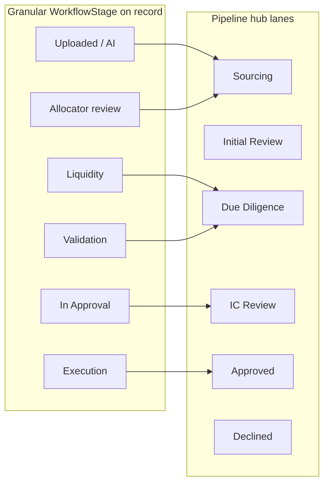

# Capital call lifecycle (FO allocator view)

Короткий продуктовий опис узгодження **внутрішнього workflow** одного запису про capital call із **общими колонками Investment Pipeline hub** і тем, що зазвичай показують **LP-портали** vs **fund-admin / treasury** системи на ринку.

## Два шари lifecycle

- **Шар колонки hub** задає порівнюваність з deal-flow («де цей процес стоїть поруч із іншими інвестиційними задачами»). Мапінг: [`capitalWorkflowToHubStage`](src/data/thornton/hub-pipeline-stages.ts), колонки: [`HUB_PIPELINE_COLUMNS`](src/data/thornton/hub-pipeline-stages.ts), підписи дошки capital calls: [`HUB_CAPITAL_KANBAN_CAPTION`](src/data/thornton/hub-pipeline-stages.ts).
- **Шар `WorkflowStage` на записі** (`CapitalCallDecision.stage` у [`capital-call-decisions-data.ts`](src/data/thornton/capital-call-decisions-data.ts)) керує детальною дорогою та бейджами в UI (див. [`CapitalCallDetailPage`](src/components/pages/CapitalCallDetailPage.tsx)).

## Таблиця: внутрішній етап → колонка hub

Ім’я в колонках Kanban береться з `HUB_PIPELINE_COLUMNS`; текст етапу в деталі — з конфігу в `CapitalCallDetailPage` / канбан-чіпів.

| `WorkflowStage` (дані) | Типові підписи в UI | Hub lane (`PipelineStage`) |
| --- | --- | --- |
| `ai-match` | Uploaded / AI | `sourcing` |
| `allocator-review` | Allocator review | `sourcing` |
| `approval` | In approval | `ic-review` |
| `liquidity-check` | Liquidity | `due-diligence` |
| `validation` | Validation (docs) | `due-diligence` |
| `execution` | Execution / wire-ready | `approved` |

**Investment Pipeline hub** також може вбудовувати окремі **картки capital call** лише в певних колонках (`ic-review`, `approved`) — логіка в [`InvestmentPipelinePage.tsx`](src/components/pages/InvestmentPipelinePage.tsx) (`PIPELINE_EMBED_CAPITAL_COLUMNS`).

## Ролі й фокус (орієнтир для UX)

Не RBAC у коді, а очікувані «головні» інтереси:

| Зона роботи | Що зазвичай важливо |
| --- | --- |
| **Allocator / investment ops** | Intake PDF/e-mail, AI-екстракція, нотатки allocator, узгодження allocation по entities. |
| **IC / principal approval** | Ланцюг апрувів, сума відносно commitment, строки due. |
| **Finance / treasury** | Ліквідність до/після wire, валідація документа, інструкції, виконання та запис у бухгалтерії/CRM. |
| **Compliance** | Частина ланцюга approval (за поточним mock у деталі; можна явно звузити під політику сімʼї в проді). |

**Capital Flows workspace** об’єднує дошку й список одного й того самого набору записів: [`CapitalCallsPage.tsx`](src/components/pages/CapitalCallsPage.tsx) (Board \| List → List рендерить [`DecisionsPage`](src/components/pages/DecisionsPage.tsx) у режимі `embeddedMergeShell`).

## Як інші класи продуктів ставляться до «картки capital call»

- **LP investor portals**: пріоритет notice, сума для даного LP/investor account, deadline, wire, статус платежу, доступ до документа; інколи fund-level KPI «для контексту». Орієнтовані на підписника LP, не наallocator кількох trusts.
- **Fund admin / allocator / treasury tooling**: акцент на pro-rata/ commitment arithmetic, платежному статусі, звірці, audit trail, нагадуваннях, іноді генерації документів для кастодіанів чи платіжних шин.

Тому **одна форма карти для всього світу** не потрібна: ваша модель **внутрішньої операційної картки + detail** наближається до fund-admin траси; embed на пайплайн додає **портфельну орієнтацію** (звʼязок з deal/asset через дані типу [`pipelineDealId`](src/data/thornton/capital-call-decisions-data.ts)).

## Мінімальний набір на картці (перевірка продукту)

- сума й контекст commitment / номер виклику;
- дата due та відносна urgency;
- короткий бейдж етапу (`WorkflowStage`/hub lane);
- entity / vehicle (і за потреби лінк на батьківський pipeline item).

Це сумісне з уже реалізованими канбан-картами ([`CapitalCallKanbanCard`](src/components/molecules/CapitalCallKanbanCard.tsx)), баннером linked call на [`InvestmentPipelinePage`](src/components/pages/InvestmentPipelinePage.tsx), і деталлю ([`CapitalCallDetailPage.tsx`](src/components/pages/CapitalCallDetailPage.tsx)).
